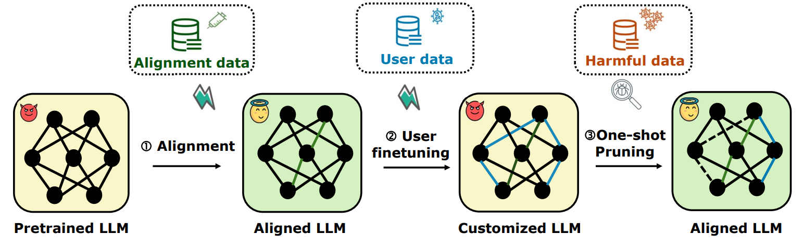

<!-- markdownlint-disable first-line-h1 -->
<!-- markdownlint-disable html -->

<h1 align="center">Antidote: Post-fine-tuning Safety Alignment for Large Language Models against Harmful Fine-tuning </h1>

[[`📕 Paper`](https://openreview.net/pdf?id=Arepl4R86m)]  [[`Poster`](antidote_poster.png)]


This is unofficial re-implementation of the paper "Antidote: Post-fine-tuning Safety Alignment for Large Language Models against Harmful Fine-tuning Attack" (ICML2025)


## About Harmful fine-tuning
Fine-tuning-as-a-service allows users to upload data to service provider (e.g., OpenAI) for fine-tuning the base model. The mode The fine-tuend model is then deployed in the server and serve customized user need. Such a procedure usually contains two sequential stages: i) safety alignment stage-- the model is safety aligned with safety data. ii) fine-tuning stage-- the aligned model produced by the first stage is fine-tuned on user provided data.  


**However, such scenario expose serious safety issue,** because the users might intentionally/unintentionally upload harmful data to break down the safety alignment of the victim LLMs.  Specifically, the model suffers from **harmful fine-tuning attack**, the customized LLM forget the alignment knowledge and exhbit harmful behavior after fine-tuning on partial harmful data.   See the following figure for an illustration. 


<div align="center">
  
</div>


## About the Antidote method

Antidote is a post-fine-tuning safety alignment method against the threat of harmful fine-tuning. We consider a three-stage scheme for safety-aligned fine-tuning-as-a-service: 

i) **Alignment stage**, in which we align the model with human-preference dataset (alignment dataset).

ii) **User fine-tuning stage**, in which we finetune the model with a user finetuning dataset (which is mixed with harmful instance). 

iii) **Post fine-tuning stage**, in which Antidote is applied. The idea is to remove harmful parameters to repair the model from harmful behavior.    


## Main code logistic
We implement a cusomized trainer on top of the original HuggingFace Trainer. To achieve Antidote,  we append a function `save_mask()` in `AntidoteTrainer`. This fuction calls the wanda score calculation function as follows, and derives the harmful mask that captures the topk important parameters over the realignment dataset.   

`self.mask = prune_wanda_outlier(self.args, self.model.model, None, device=torch.device("cuda:0"))`


## Package requirement
The package requirement is listed in `requirements.txt`. Please strictly keep the version of some packages as specified in the requirements, e.g., transformers, torch, etc. We notice that our code is not compatible with the newest transformers package. 


## Data  preparation
For finetuning task, we first need to run the following scripts to prepare the sueprvised finetuning data.
```
cd sst2
python build_dataset.py
cd ../gsm8k
python build_dataset.py
cd ../ag_news
python build_dataset.py
cd ..
```

## Huggingface Llama2 access
Llama2-7B is a gated repo, which need a formal request to get access to the model. Check out https://huggingface.co/meta-llama/Llama-2-7b-hf.
After applying permission from meta, you should be able to access the model, but you first need to enter your token in the file `huggingface_token.txt`.


## Example command to run

We prepare scripts for re-producing all the experiments in the paper. We recommend to use Slurm to reproduce the results as the logging file will be automatically organized into the script directory (if you don't use Slurm, just replace `sbatch` with `bash` in our example).

We first run SFT to produce the aligned model. 
```
cd script/alignment
sbatch  SFT.sh
```
Then we run the fine-tuning stage/post-fine-tuning stage by calling this script:
```
cd ../finetune
sbatch  antidote_poison_ratio.sh 0.1
```

For comparison, we can finetune the model with SFT in the same data setting.
```
sbatch  sft_poison_ratio.sh 0.1
cd ../..
```


## A line of attack/defense designs

We are commited to design attacks and defenses from different angles in the topic of harmful fine-tuning. The currently avaialble work built in the disl group include:
* Attack: [Virus](https://github.com/git-disl/Virus)
* Alignment stage defense: [Vaccine](https://github.com/git-disl/Vaccine), [Booster](https://github.com/git-disl/Booster/tree/main)
* Fine-tuning stage defense: [Lisa](https://github.com/git-disl/Lisa)
* Post-fine-tuning stage defense: [Antidote](https://arxiv.org/abs/2408.09600)
* Survey: [Survey](https://arxiv.org/abs/2409.18169)

We always welcome different forms of collaboration. If you are interested, please reach out Tiansheng Huang (thuang374@gatech.edu) for discussion. 

## Papers of harmful fine-tuning attacks/defense in ICML2025

Of note, along with Antidote, there are 7 papers on harmful fine-tuning attacks/defense being accepted by ICML2025. Please consider to check them out if interested.  

* Towards LLM Unlearning Resilient to Relearning Attacks: A Sharpness-Aware Minimization Perspective and Beyond 

* Invariance Makes LLM Unlearning Resilient Even to Unanticipated Downstream Fine-Tuning

* Benign Samples Matter! Fine-tuning On Outlier Benign Samples Severely Breaks Safety 

* Antidote: Post-fine-tuning safety alignment for large language models against harmful fine-tuning

* Vulnerability-Aware Alignment: Mitigating Uneven Forgetting in Harmful Fine-Tuning

* Safe Delta: Consistently Preserving Safety when Fine-Tuning LLMs on Diverse Datasets

* Model Immunization from a Condition Number Perspective

## Citation
If you find our research interesting, you may cite the following papers. 
```

@inproceedings{huangantidote,
  title={Antidote: Post-fine-tuning Safety Alignment for Large Language Models against Harmful Fine-tuning Attack},
  author={Huang, Tiansheng and Bhattacharya, Gautam and Joshi, Pratik and Kimball, Joshua and Liu, Ling},
  booktitle={Forty-second International Conference on Machine Learning}
}


@inproceedings{huangbooster,
  title={Booster: Tackling Harmful Fine-tuning for Large Language Models via Attenuating Harmful Perturbation},
  author={Huang, Tiansheng and Hu, Sihao and Ilhan, Fatih and Tekin, Selim Furkan and Liu, Ling},
  booktitle={The Thirteenth International Conference on Learning Representations}
}

@article{huang2025virus,
  title={Virus: Harmful Fine-tuning Attack for Large Language Models Bypassing Guardrail Moderation},
  author={Huang, Tiansheng and Hu, Sihao and Ilhan, Fatih and Tekin, Selim Furkan and Liu, Ling},
  journal={arXiv preprint arXiv:2501.17433},
  year={2025}
}

@article{huang2024harmful,
  title={Harmful fine-tuning attacks and defenses for large language models: A survey},
  author={Huang, Tiansheng and Hu, Sihao and Ilhan, Fatih and Tekin, Selim Furkan and Liu, Ling},
  journal={arXiv preprint arXiv:2409.18169},
  year={2024}
}


@inproceedings{huanglisa,
  title={Lisa: Lazy Safety Alignment for Large Language Models against Harmful Fine-tuning Attack},
  author={Huang, Tiansheng and Hu, Sihao and Ilhan, Fatih and Tekin, Selim Furkan and Liu, Ling},
  booktitle={The Thirty-eighth Annual Conference on Neural Information Processing Systems}
}

@inproceedings{huangvaccine,
  title={Vaccine: Perturbation-aware Alignment for Large Language Models against Harmful Fine-tuning Attack},
  author={Huang, Tiansheng and Hu, Sihao and Liu, Ling},
  booktitle={The Thirty-eighth Annual Conference on Neural Information Processing Systems}
}

```


